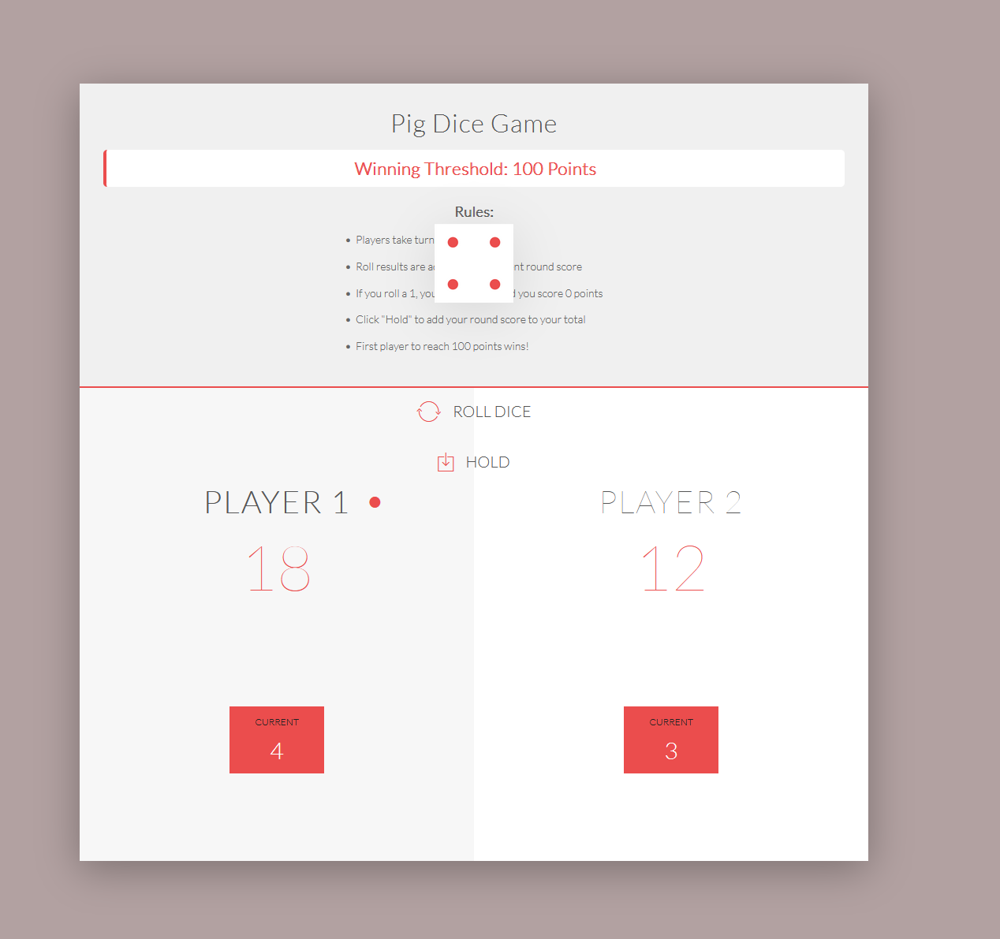

## 🎲 JavaScript Pig Dice Game

A sleek, interactive, and browser-native version of the classic Pig Dice Game. Challenge a friend to a battle of luck and strategy—know when to roll and when to hold!

<div align="center">  </div>
## 📖 About the Game

This project demonstrates the power of "Vanilla" web technologies. It is a clean, responsive application that brings the traditional dice game into the modern browser.
## 🎮 Gameplay Rules

    Roll the Dice: Accumulate points in your current turn with every roll.

    The "Pig" Rule: Roll a 1, and you lose all points for that turn. Your turn ends immediately!

    Hold Your Score: Click "Hold" to bank your current points into your total score and pass the play to your opponent.

    Winning: The first player to reach the winning threshold (default: 100 points) is declared the champion.

## 🚀 Key Features

    Dynamic Score Tracking: Real-time updates for both current turn and total scores.

    Visual Dice Simulation: High-quality assets represent each dice face from 1 to 6.

    Responsive Design: Optimized for a consistent experience across all screen sizes.

    Zero Dependencies: Runs instantly in any modern web browser without specialized runtimes.

## 🛠️ Built With

    HTML5: Structured the game elements and user interface.

    CSS3: Crafted a minimalist, responsive layout with clean typography.

    JavaScript: Powered the core game logic, DOM manipulation, and event handling.

## 💻 Quick Start

Clone the repository:
```

git clone https://github.com/hamzaakmal98/JavaScript-PigDiceRoll-Game.git

```
Open the game: Navigate to the folder and open index.html in your favorite browser.
